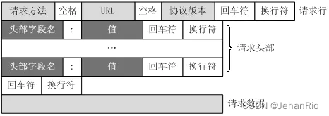
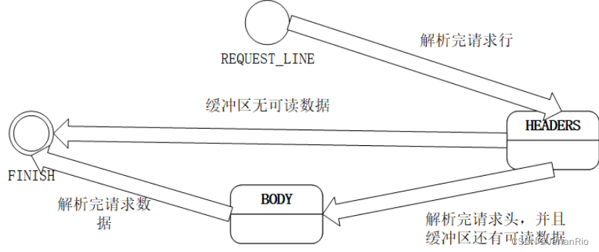

# HTTP解析
### 1. HTTP请求报文与相应报文格式
**请求报文**：请求行、请求头、空行、请求体


**响应报文**：状态行、消息报头、空行、响应正文
```
HTTP/1.1 200 OK
Date: Fri, 22 May 2009 06:07:21 GMT
Content-Type: text/html; charset=UTF-8
\r\n
<html>
      <head></head>
      <body>
            <!--body goes here-->
      </body>
</html>
```

### 2. 有限状态机


### 3. 正则表达式
参考blog：https://blog.csdn.net/xuemoyao/article/details/8033138?ops_request_misc=%257B%2522request%255Fid%2522%253A%252254AA9E27-A9E3-4F42-B8A5-08322FA5C16A%2522%252C%2522scm%2522%253A%252220140713.130102334..%2522%257D&request_id=54AA9E27-A9E3-4F42-B8A5-08322FA5C16A&biz_id=0&utm_medium=distribute.pc_search_result.none-task-blog-2~all~top_positive~default-1-8033138-null-null.142^v100^pc_search_result_base6&utm_term=%E6%AD%A3%E5%88%99%E8%A1%A8%E8%BE%BE%E5%BC%8F&spm=1018.2226.3001.4187
##### 3.1 元字符
| 代码 | 说明 |
|------|------|
| .    | 匹配除换行符以外的任意字符 |
| \w   | 匹配字母或数字或下划线或汉字 |
| \s   | 匹配任意的空白符 |
| \d   | 匹配数字 |
| \b   | 匹配单词的开始或结束 |
| ^    | 匹配字符串的开始（在集合字符里[^a]表示非（不匹配）的意思 |
| $    | 匹配字符串的结束 |

##### 3.2 反义字符
| 代码/语法 | 说明 |
|-----------|------|
| \W        | 匹配任意不是字母，数字，下划线，汉字的字符 |
| \S        | 匹配任意不是空白符的字符 |
| \D        | 匹配任意非数字的字符 |
| \B        | 匹配不是单词开头或结束的位置 |
| [^x]      | 匹配除了x以外的任意字符 |
| [^aeiou]  | 匹配除了aeiou这几个字母以外的任意字符 |

##### 3.3 限定字符
| 代码/语法 | 说明 |
|-----------|------|
| *         | 重复零次或更多次 |
| +         | 重复一次或更多次 |
| ?         | 重复零次或一次 |
| {n}       | 重复n次 |
| {n,}      | 重复n次或更多次 |
| {n,m}     | 重复n到m次 |

##### 3.4 转义字符
如果需要匹配元字符，则需要使用转义字符：\
例如： 需要匹配qq邮箱 \d{8,11}@qq\.com，这里的“.”需要加上反斜杠

##### 3.5 字符分支
字符分支用于满足不同情况的选择，用“|”将不同条件分开，表示匹配任意二者之一都可以
例如：\d{3}-\d{8}|\d{4}-\d{8}  可以匹配两种不同长度区号的固定电话

##### 3.6 字符分组
用于将多个字符重复，通过（）分组
形如：(\d\w){3} 重复匹配3次(\d\w)
```
表示IP地址：
^(?:(?:25[0-5]|2[0-4][0-9]|[01]?[0-9][0-9]?)\.){3}(?:25[0-5]|2[0-4][0-9]|[01]?[0-9][0-9]?)$
```

常用分组语法：
| 分类     | 代码/语法       | 说明                                    |
|----------|------------------|-----------------------------------------|
| 捕获     | (exp)            | 匹配exp,并捕获文本到自动命名的组里     |
|          | (?<name>exp)     | 匹配exp,并捕获文本到名称为name的组里   |
|          | (?:exp)          | 匹配exp,不捕获匹配的文本，也不给此分组分配组号 |
| 零宽断言 | (?=exp)          | 匹配exp前面的位置                      |
|          | (?<=exp)         | 匹配exp后面的位置                      |
|          | (?!exp)          | 匹配后面跟的不是exp的位置              |
|          | (?<!exp)         | 匹配前面不是exp的位置                  |
| 注释     | (?#comment)      | 这种类型的分组不对正则表达式的处理产生任何影响，用于提供注释让人阅读 |

##### 3.7 懒惰匹配与贪婪匹配
**贪婪匹配**：正则表达式中包含重复的限定符时，通常的行为是匹配尽可能多的字符。
例如： a.*b，它将会匹配最长的以a开始，以b结束的字符串。如果用它来搜索aabab的话，它会匹配整个字符串aabab。

**懒惰匹配**，有时候需要匹配尽可能少的字符。
常用懒惰匹配限定符
| 代码/语法 | 说明 |
|-----------|------|
| *?        | 重复任意次，但尽可能少重复 |
| +?        | 重复1次或更多次，但尽可能少重复 |
| ??        | 重复0次或1次，但尽可能少重复 |
| {n,m}?    | 重复n到m次，但尽可能少重复 |
| {n,}?     | 重复n次以上，但尽可能少重复 |


